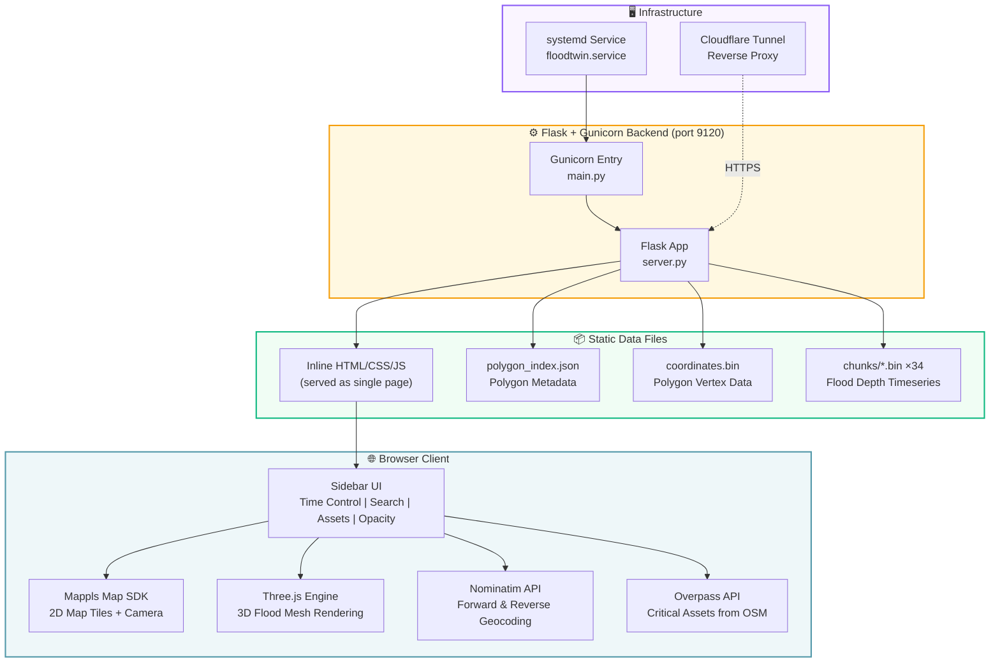
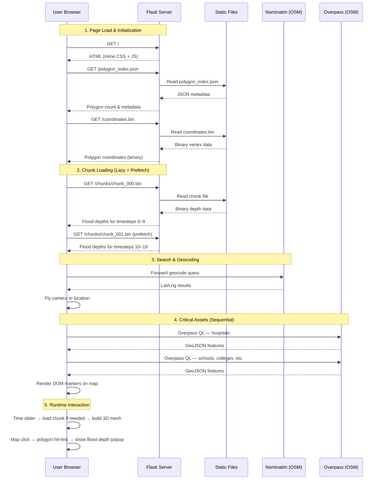
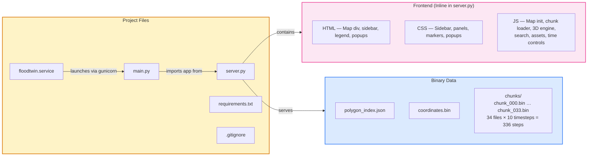

# FloodTwin — Architecture & Workflow

> 3D Immersive Flood Visualization Engine for Gurugram region.  
> Simulates flood depth over **337 timesteps** (5-min intervals starting 09-July-2025) on a 3D map.

---

## 1. High-Level Architecture



---

## 2. Data Flow — Request Sequence



---

## 3. Project Structure Map



---

## 4. Component Explanations

### 4.1 Backend Components

| Component | File | Purpose |
|-----------|------|---------|
| **Flask App** | `server.py` | Core web server. Defines two routes: `/` serves the full HTML page (inline); `/<path>` serves any static file (binary data, chunks) from the project directory. |
| **Gunicorn Entry** | `main.py` | Thin wrapper that imports `app` from `server.py` and exposes it as `application` for Gunicorn's WSGI interface. |
| **Systemd Service** | `floodtwin.service` | Manages the process lifecycle — auto-starts on boot, restarts on crash (every 30s), runs 4 Gunicorn workers bound to port `9120`. |
| **Dependencies** | `requirements.txt` | Python packages: Flask, Gunicorn, Waitress (dev fallback), and their transitive deps. |

### 4.2 Data Components

| Component | File(s) | Purpose |
|-----------|---------|---------|
| **Polygon Index** | `polygon_index.json` | JSON array describing the flood simulation polygons. Used at startup to determine `polygonCount`. |
| **Coordinates Binary** | `coordinates.bin` | Binary file containing vertex coordinates (lng, lat as Float64) for every polygon. Parsed once at load; also used for click hit-testing via ray-cast. |
| **Depth Chunks** | `chunks/chunk_000.bin` … `chunk_033.bin` (34 files) | Each chunk holds flood depth values (Float32) for **10 consecutive timesteps**. 34 chunks × 10 = 340 slots, covering all 337 simulation steps. Loaded lazily with an LRU cache of 3 chunks max. |

### 4.3 Frontend Components (all inline in `server.py`)

| Component | Technology | Purpose |
|-----------|------------|---------|
| **Mappls Map SDK** | Mappls JS SDK (v3.0 vector) | Renders the 2D base map (vector tiles), handles camera events (pan, zoom, pitch, rotate), and provides `map.project()` for coordinate-to-pixel conversion. |
| **Three.js 3D Engine** | Three.js r128 | Renders the 3D flood water meshes as a custom map layer. Builds extruded polygon geometry from depth data, colors by severity bands, and composites onto the map's WebGL canvas. |
| **Time Control Panel** | Vanilla JS | Slider (0–336), play/pause/step buttons, and speed pills (0.5×–4×). Moving the slider triggers `updateStep()` which loads the required chunk and rebuilds the 3D mesh. |
| **Search / Geocoding** | Nominatim (OSM) | Forward geocoding (type-ahead suggestions) and reverse geocoding (click on map → address). Places a temporary pin and flies the camera to the result. |
| **Critical Assets Overlay** | Overpass API (OSM) | Fetches 6 categories of infrastructure (hospitals, schools, colleges, fire stations, police, pharmacies) within the study area bounding box. Renders as DOM-based markers with click-to-popup details. Categories are toggled via sidebar pills. |
| **Flood Depth Popup** | Vanilla JS + CSS | On map click, performs a point-in-polygon ray-cast against all flooded polygons at the current timestep. If a hit is found, shows a styled popup with depth value, severity badge, time, and coordinates. |
| **Legend** | HTML + CSS | Fixed card (top-right) showing 4 flood depth severity bands: Low (<0.5m), Moderate (0.5–1m), High (1–2m), Severe (>2m) with matching color swatches. |
| **Layer Opacity Control** | Range slider | Adjusts the transparency of the Three.js water mesh material in real-time (0–100%). |

### 4.4 External Services

| Service | Endpoint | Usage |
|---------|----------|-------|
| **Mappls Map SDK** | `apis.mappls.com` | Vector map tiles and spatial SDK. API key embedded in the script tag. |
| **Nominatim** | `nominatim.openstreetmap.org` | Free geocoding — address search and reverse lookup on map click. |
| **Overpass** | `overpass-api.de` | OSM data query engine — fetches nearby critical infrastructure. Sequential requests with 1s delay and retry on 429. |
| **Three.js CDN** | `cdnjs.cloudflare.com` | Three.js r128 library loaded from CDN. |

### 4.5 Infrastructure

| Component | Detail |
|-----------|--------|
| **Runtime** | Python 3 (Miniconda `floodtwin` env) |
| **WSGI Server** | Gunicorn with 4 workers |
| **Dev Server** | Waitress (8 threads, port 9120) — used when running `server.py` directly |
| **Process Manager** | systemd (`floodtwin.service`) — auto-restart, runs as `production` user |
| **Reverse Proxy** | Cloudflare Tunnel for HTTPS termination and public access |

---

## 5. Key Design Decisions

| Decision | Rationale |
|----------|-----------|
| **Binary chunk format** | Float32 arrays are ~4× smaller than JSON for numeric grids and parse instantly via `Float32Array`. |
| **Lazy loading + LRU cache (3 chunks)** | Only 3 of 34 chunks stay in memory. The next chunk is prefetched while the current one plays, giving seamless playback without loading all 34 files upfront. |
| **Inline HTML** | The entire frontend is a single HTML string inside `server.py` — zero build tooling, no separate static assets to manage, trivially deployable. |
| **DOM-based markers** | Mappls SDK doesn't expose `maplibregl.Marker`, so asset markers are plain `<div>` elements repositioned on every camera event via `map.project()`. |
| **Point-in-polygon hit-test** | Classic even-odd ray-cast algorithm against pre-parsed polygon rings. Runs entirely client-side with no server round-trip. |

---

## 6. Startup Flow

```
systemd start → gunicorn (main.py)
                    ↓
              imports server.py → Flask app created
                    ↓
              Binds 0.0.0.0:9120 with 4 workers
                    ↓
         Browser requests GET /
                    ↓
         Receives full HTML page
                    ↓
     ┌──────────────┼──────────────┐
     ↓              ↓              ↓
  Init Mappls    Fetch polygon   Load assets
  Map + Three.js  index + coords  from Overpass
     ↓              ↓
  Add 3D layer   Prefetch chunks
     ↓           0 & 1
  Ready — user interacts with
  time slider, search, layers
```
